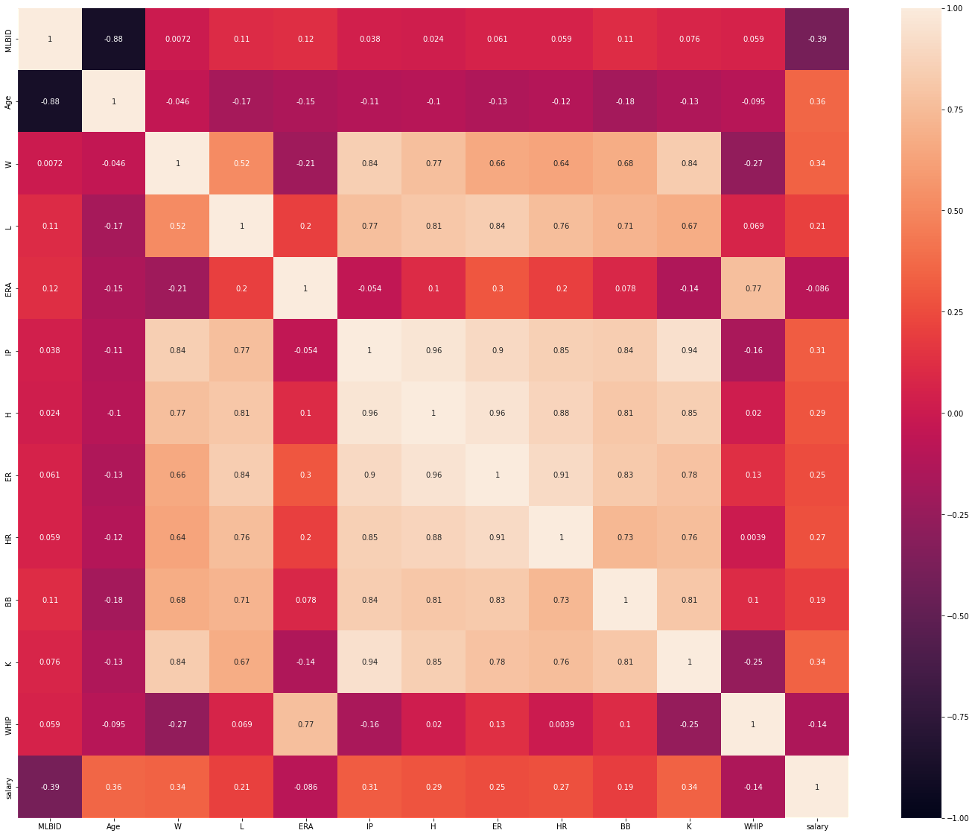

# Baseball Recommendation System
---
*By Ihza Gonzales*

## Executive Summary

With MLB teams having a variety of different markets, a small market team wants players who can bring in wins without the large price tag. This recommender system that was created makes it simple to find players who are similar to those all star players. A user can simply put in a player like Mookie Betts and find similar players like him. In addition the recommender also outputs the predicted stats of players for the upcoming season and their predicted salary based on their stats. The model Vector Auto Regression (VAR) was used to forcasts the stats. A voting regressor was used to predict the salary. The RMSE for this was around 3 million both for pitchers and batters. In this regard, it did not do well to predict salary but it can potential be used as a basis for players that might be negotiating new contracts. The rest of the project outlines the process and details of the how the recommender was made.

## Project Structure

1. README.md
2. 

Jupyter Notebooks (17) 

    1.1_stats_b_data.ipynb 
    1.2_stats_p_data.ipynb 
    1.3_salary_data.ipynb 
    2.1_active_players_cleaning.ipynb 
    2.2_stats_b_cleaning.ipynb 
    2.3_stats_p_cleaning.ipynb 
    2.4_salary_b_cleaning.ipynb 
    2.5_salary_p_cleaning.ipynb 
    3_eda.ipynb 
    4.1_time_series_b.ipynb 
    4.2_time_series_p.ipynb 
    5.1_regression_b.ipynb 
    5.2_regression_p.ipynb 
    6.1_kmean_b.ipynb 
    6.2_kmean_p.ipynb 
    7.1_recommender_b.ipynb 
    7.2_recommender_p.ipynb 
   

3. 

App

    app.py 
    index.html 
    results.html 
    table_b.html 
    table_p.html 
    style.css 
   

4. 

Presentation

    presentation.pdf 
    presentation image files 
   

6. Conclusion.md
5. Data Files
6. Model Files
7. Pickle Files
8. Image Files

## Problem Statement

Many small market teams like the Baltimore Orioles or Oakland A's who have small payrolls cannot afford players like Mookie Betts or Mike Trout ([source](https://www.sportsmediawatch.com/nba-market-size-nfl-mlb-nhl-nielsen-ratings/)). So what if there was a way to find players that perform like Mookie Betts but do not have the high price tag. This project aims to do just that. A recommender system will be created and in addition the stats will be forecasted and the salaries will also be predicted. The first model that will be used is a Vector Auto Regression (VAR) model and evaluation metric is root mean squared error (RMSE). This will forecast the stats. The next model is a voting regressor with AdaBoost, RidgeCV, LassoCV, and ElasticNetCV. The evaulation metrics are R2 and RMSE. This model is for predicting the salary. The last model is a K-Means cluster. The evaluation metric is silhoutte score. The results of this model will be used as a feature to help strengthen the recommendations. A flask app will be created to showcase the recommender system. A user can input a player name and the top 10 recommended players along with predicted stats and salary will be outputted. 

## Data Description

Original Datasets:

1. SFBB Player ID Map - PLAYERIDMAP.csv ([source](https://www.smartfantasybaseball.com/tools/))
2. mlb-player-stats-Batters.csv ([source](https://www.rotowire.com/baseball/stats.php))
3. mlb-player-stats-P.csv ([source](https://www.rotowire.com/baseball/stats.php))
4. All Player Gamelog Stats ([source](https://baseballsavant.mlb.com/savant-player/))

### Data Dictionary

|Feature|Type|Dataset|Description|
|---|---|---|---|
|**salary**|int|batter/pitcher|The salary of players ($)|
|**AB**|int|batter|At-bat: how many times a batter reaches base|
|**R**|int|batter|Runs: how many times a player reaches home base|
|**H**|int|batter/pitcher|Hits: when a player successful hits the ball and reaches on base|
|**2B**|int|batter|Double: when a player hits successfully and reaches second base|
|**3B**|int|batter|Triple: when a player hits successfully and reaches third base|
|**HR**|int|batter/pitcher|Home Run: when a player hits successfully and reaches home base|
|**RBI**|int|batter|Runs Batted In: how many runs score during the players plate appearance|
|**BB**|int|batter/pitcher|Walks: when a player reaches base because pitcher has thrown four balls out of strike zone|
|**SO**|int|batter/pitcher|Strikeout: when a player is not able to successfully reach base after three balls in strike zone|
|**AVG**|float|batter|Average: hits/total at-bat|
|**OBP**|float|batter|On-Base Percentage: how frequently a batter reaches base|
|**SLG**|float|batter|Slugging: the total number of bases a player records per at-bat|
|**OPS**|float|batter|On-base Plus Slugging: OBP + SLG|
|**W**|int|pitcher|Win: the pitcher of record when his team takes the lead for good |
|**L**|int|pitcher|Lose: loss when a run that is charged to him proves to be the go-ahead run in the game|
|**ERA**|float|pitcher|Earned Run Average: the number of earned runs a pitcher allows per nine innings|
|**IP**|float|pitcher|Innings Pitched: how many innings are pitched|
|**ER**|int|pitcher|Earned Run: any run that scores against a pitcher without the benefit of an error or a passed ball|
|**WHIP**|float|pitcher|Walks And Hits Per Inning Pitched|

*Information About Statistic Meaning was acquired from [mlb.com](https://www.mlb.com/glossary/).*

## Exploratory Data Analysis (EDA)

For exploring the data, the first thing to explore was if the datasets used for time series showed signs of seasonality. A autocorrelation and partial autocorrelation graphs were made and it was found that our data had no signs of seasonality. 

The next data to explore was the stats of batters. A heatmap was made and it was found that many of the stats were highly correlated with each other. It was also seen that the correlation of stats to salary are not very correlated with each other. It was also found that salary was skewed to the left. 

The last data to explore was the stats of pitchers. Similar to batters many of the stats are highly correlated with each other. It was interesting to note that the stats of ERA and WHIP were not as correlated with other stats. The salary was also found to be skewed to the left. 

## Conclusion

A recommender system was created and along with it are the predicted stats and salaries of players. The recommended players seem to be similar to the players being looked at based on how their stats compared. The prediction of the stats seem to predict well since the RMSE found was 1 for most stats. There is a caveat when looking at those forecasted stats becuase the further into the future the stats are forecasted the more likely that the averages will be forecasted. So there are limitations in using the forcasted stats. For predicting the salary of players, the model did not predict well. It had a very low score and an RMSE of around 3 million. The project was able to completed but it definetely needs work in terms of predicting salaries and if wanting to forecast further into the baseball season.

## Recommendations For Next Steps

1. Fix the data collection, as some active players were not included specifically those with a suffix to their name. There was also a problem getting the data for Shohei Ohtani as he is a two way problem and has both stats of batters and pitchers.

2. Incorporate Minor Leagues and international players to the list of active players. This would allow for more players to be recommended and allow a team to tap potential players. 

3. The time series requires constant recent data to be able to forecast further into the future. So being able to automate this and include this function into the app will help it considerably.

4. Baseball is filled with different stats to show the player performances. Including more of it would help make a more complex model for salary and maybe even get better recommendations. 